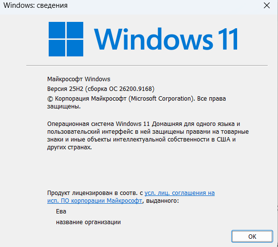
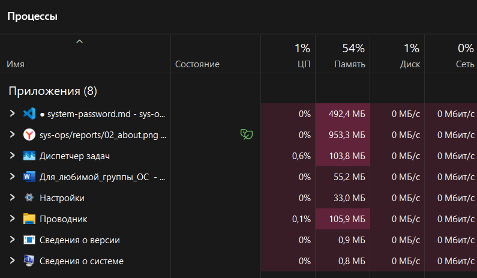

## 5. Часть B. Типы операционных систем
## Задание №1

- **Назначение**: настольная → ОС предназначена для работы пользователя на персональном компьютере, а не для управления серверами → интерфейс оптимизирован под локальное взаимодействие с пользователем.  
- **Число задач**: многозадачная → ОС позволяет одновременно исполнять множество процессов и потоков → в диспетчере задач отображается список десятков активных процессов.
- **Работа с пользователями**: многопользовательская по возможностям ОС → архитектура ОС поддерживает создание нескольких учётных записей → в «Параметрах - Учётные записи - Другие пользователи» доступна функция добавления новых пользователей
- **Интерфейс**: гибридный → ОС предоставляет графический интерфейс и доступ к командной строке → запуск Проводника и приложений через иконки (GUI) и использование cmd и PowerShell (CLI).  
- **Сфера применения**: общего назначения → ОС рассчитана на широкий круг задач, не привязана к узкой предметной области → в системе предустановлены универсальные приложения, поддерживается установка разнородного ПО.  
- **Поддержка сети**: наличие сетевых возможностей → Windows 11 обеспечивает работу в локальной сети и средств обнаружения устройств → в Параметрах - Сеть и Интернет отображаются активные подключения, возможен доступ к общим папкам и принтерам.

## Задание №2
| ОС | Где применяется | Тип | Многозадачность | Интерфейс | Ключевое отличие |
| --- | --- | --- | --- | --- | --- |
| Windows | ПК, игры, офис | Универсальная | Полная | GUI и консоль | Совместимость с ПО и играми, удобство для пользователя |
| Ubuntu (Linux) | Серверы, разработка, наука | Универсальная | Полная | GUI или терминал | Открытый код, настраиваемость, инструменты для разработчиков |
| Android | Смартфоны, планшеты, ТВ | Мобильная | Условная (с контролем фона) | Сенсорный GUI | Оптимизация под батарею, интеграция с мобильными сервисами |
| FreeRTOS (RTOS) | Микроконтроллеры, IoT, автоматика | Специализированная (реального времени) | Детерминированная (по приоритетам) | Обычно отсутствует (API/логи) | Гарантированное время реакции, малый размер, низкое энергопотребление |

---

ОС не взаимозаменяемы, потому что решают разные задачи: у них разные требования к скорости — RTOS обязана отвечать в строго заданный срок, тогда как Windows или Android допускают задержки; аппаратные условия отличаются — мобильные и встраиваемые ОС ориентированы на экономию энергии и минимального объёма памяти, а настольные делают упор на удобство и совместимость с широким спектром программ; управление задачами реализовано по‑разному — в мобильных ОС фоновые процессы ограничивают ради сохранения заряда батареи, в серверных стремятся максимально эффективно использовать вычислительные ресурсы; интерфейсы и экосистемы приложений адаптированы под целевую аудиторию — Windows рассчитана на обычных пользователей, а FreeRTOS не предполагает прямого взаимодействия с человеком.

| На фотографии мы видим данные о моем ноутбуке. У меня установлена Windows 11 (версия 25H2, сборка 26200.9168). Редакция системы — «Домашняя для одного языка», лицензия оформлена на меня. |

| На изображении — вкладка «Процессы» в Диспетчере задач Windows: отображены 8 приложений, включая файлы system-password.md и sys-ops/reports/02_about.png, а также системные компоненты (Диспетчер задач, Проводник, Настройки и др.). Загрузка ЦП — в пределах 0–0,6 %, использование памяти — от 0,8 МБ до 953,3 МБ (суммарно 54 % от общего объёма), активность диска и сети — нулевая. |

## ИТОГОВЫЙ ОТВЕТ
| Операционные системы различаются по назначению: Windows — для пользователей и игр, Ubuntu — для разработки и серверов, Android — для мобильных устройств, FreeRTOS — для встраиваемых систем. Windows делает упор на совместимость, Ubuntu — на открытость и инструменты для разработчиков, Android — на экономию батареи, а FreeRTOS — на предсказуемость и низкое энергопотребление. Такой набор ОС позволяет подобрать решение под любые задачи — от повседневных до специализированных. |