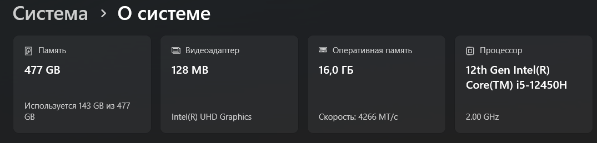
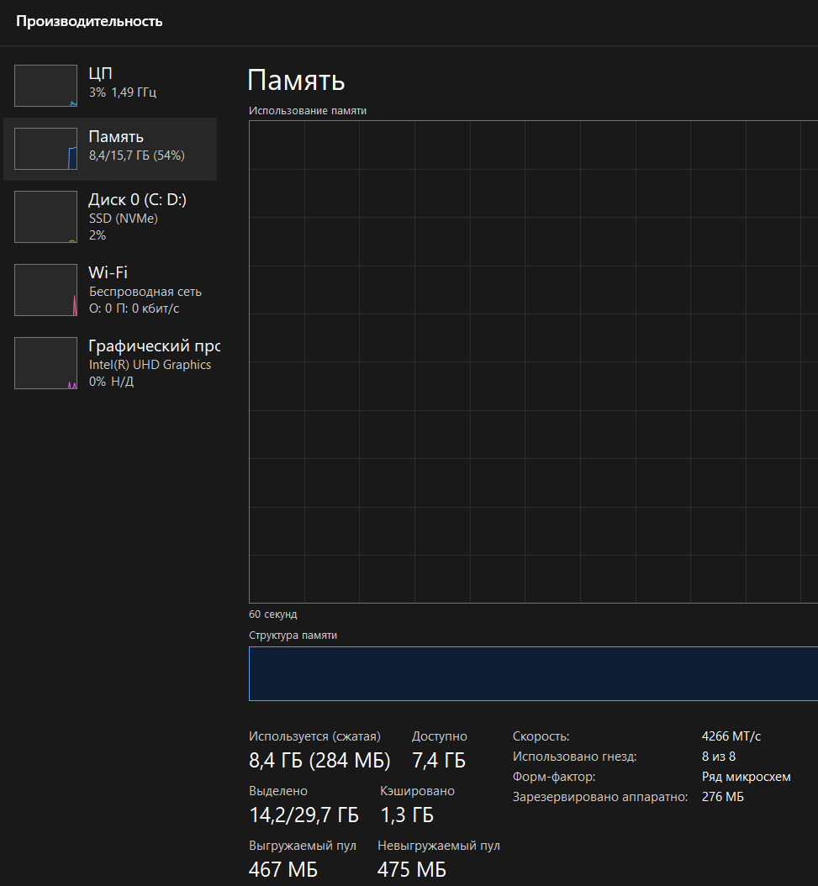
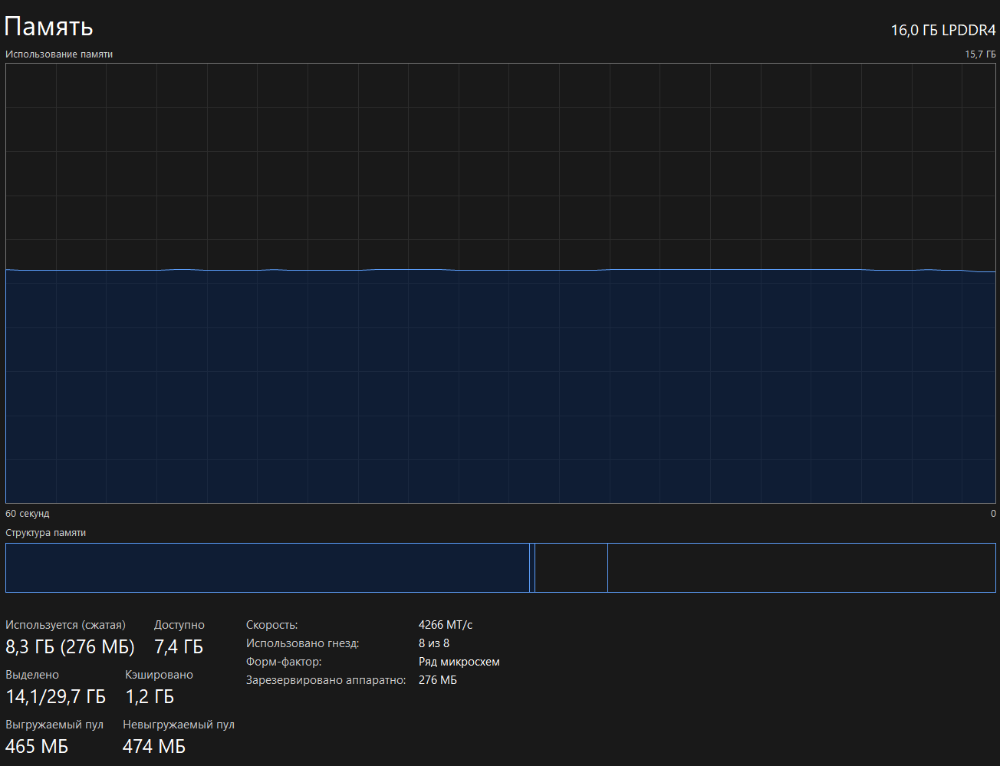
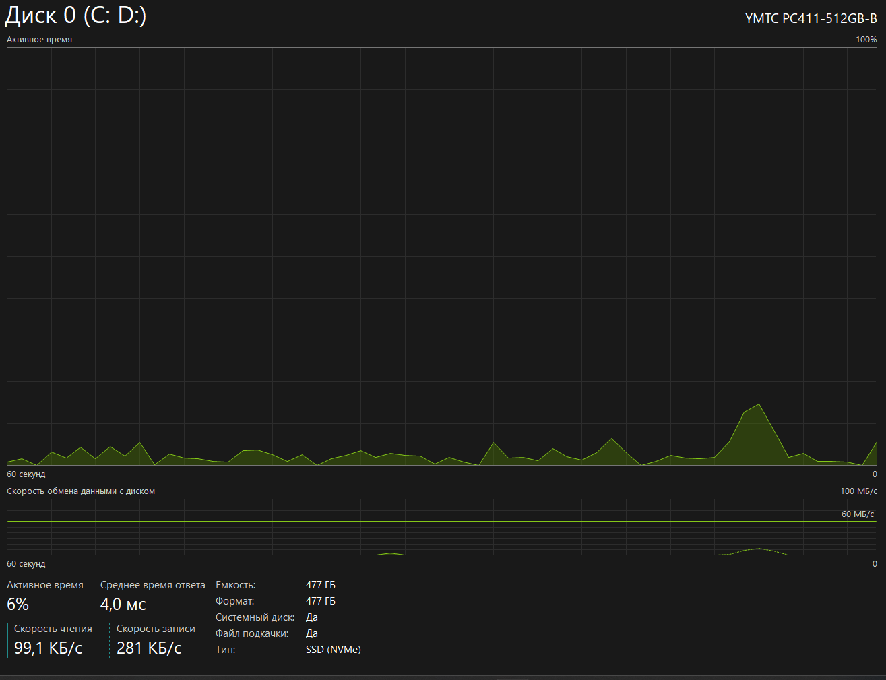
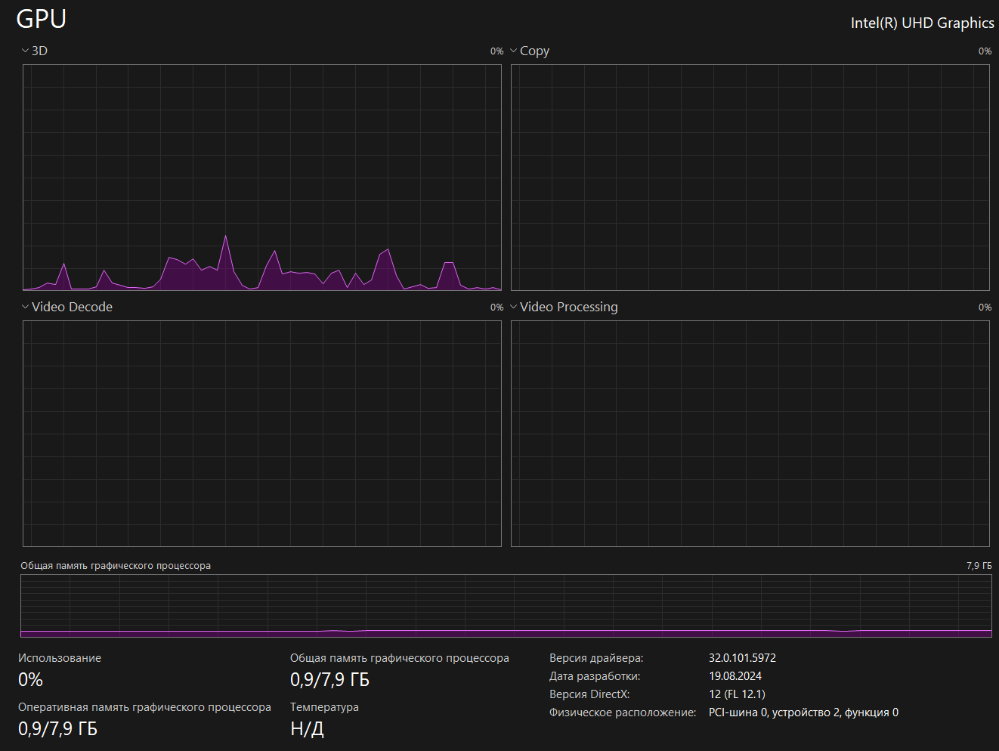

| Что исследовать | Что зафиксировать |
| --- | --- |
| Актуальность обновлений Windows 10 (версия 22H2, сборка 19045.6456) — проверить наличие критических патчей | Версия ОС: Windows 10 Pro, 22H2, сборка 19045.6456 |
| Совместимость Python 3.12.0 с используемыми библиотеками и средой VS Code | Установленные компоненты среды: VS Code, Python 3.12.0 |
| Причины аномально высокого потребления RAM процессом NVIDIA Container (9,9 ГБ при 0% загрузки) | Потребление RAM по процессам: Intel Management — 0,4 ГБ, Microsoft Office — 0,4 ГБ, NVIDIA Container — 9,9 ГБ |
| Корректность даты в BIOS (04.07.2025 выглядит как ошибка или тестовые данные) | Данные BIOS: HP Q01 Ver. 02.31.00, дата 04.07.2025 |
| Производительность SSD при типовых операциях (сборка проектов, запуск контейнеров) | Характеристики накопителя: SSD, 464 ГБ, занято 238 ГБ (~51%) |
| Температурный режим CPU/GPU под нагрузкой (при работе VS Code + Python) | Текущая нагрузка: CPU — 2%, GPU — 6% |
| Влияние Intel Management на сетевые и системные ресурсы | Статус фоновых служб: Intel Management (мониторинг и безопасность), Microsoft Office |
| Возможности платформы Sky Lake x64 для параллельных вычислений (AVX, многопоточность) | Аппаратная платформа: Sky Lake x64, 6 ядер, 12 логических процессоров |
| Свободное место на диске и динамику его изменения со временем | Объём RAM: 16 ГБ, занято 6,9 ГБ |
| Работу интегрированной графики Intel UHD Graphics 630 в сценариях разработки | Видеосистема: Intel UHD Graphics 630 |

| На фотографии мы видим данные о моем ноутбуке. У меня установлена Windows 11 (версия 25H2, сборка 26200.9168). Редакция системы — «Домашняя для одного языка», лицензия оформлена на меня. |

| На фотографии мы видим данные о моей системе. оперативная память моего ноутбука: 16ГБ, память: 477ГБ, видеоадаптер: 128МБ, процессор: 12th Gen Intel(R) Core(TM) i5-12450H. |

| На скриншоте — вкладка «Производительность» Диспетчера задач Windows: RAM — 15,7 ГБ (используется 8,4 ГБ, 54 %), скорость — 4266 МТ/с, зарезервировано аппаратно — 276 МБ; также видны данные по ЦП, диску и Wi‑Fi. |

| На скриншоте — вкладка «Память» Диспетчера задач: RAM — 16,0 ГБ (LPDDR4, 4266 МТ/с), используется 8,3 ГБ, доступно 7,4 ГБ, зарезервировано аппаратно 276 МБ, занято 8 из 8 слотов; также видны кэшированная память (1,2 ГБ) и пулы (выгружаемый — 465 МБ, невыгружаемый — 474 МБ). |

| На изображении — вкладка мониторинга диска в Диспетчере задач Windows: показан накопитель YMTC PC411‑512GB‑B (SSD NVMe) ёмкостью 477 ГБ, выступающий в роли системного диска с файлом подкачки. Активное время диска — 6 %, среднее время ответа — 4,0 мс, скорость чтения — 99,1 КБ/с, записи — 281 КБ/с; графики демонстрируют эпизодические всплески нагрузки без устойчивого пика. |

| На изображении — мониторинг GPU в Диспетчере задач: показана встроенная графика Intel(R) UHD Graphics с общей и оперативной памятью 0,9 из 7,9 ГБ, текущее использование — 0 %, температура не определена (Н/Д). Графики по нагрузкам 3D, Copy, Video Decode и Video Processing демонстрируют эпизодические незначительные всплески активности. Версия драйвера — 32.0.101.5972 (от 19.08.2024), поддерживается DirectX 12 (FL 12.1). |

## КРАТКИЙ ВЫВОД:
| Ноутбук условно подходит для программирования и работы с виртуальными машинами: 15,7 ГБ оперативной памяти и NVMe SSD обеспечивают комфортную работу и позволяют запускать 1–2 виртуальные машины, но для точной оценки CPU не хватает данных о модели и числе ядер, а аппаратную виртуализацию (VT‑x/AMD‑V) нужно отдельно проверить и при необходимости включить в BIOS. |